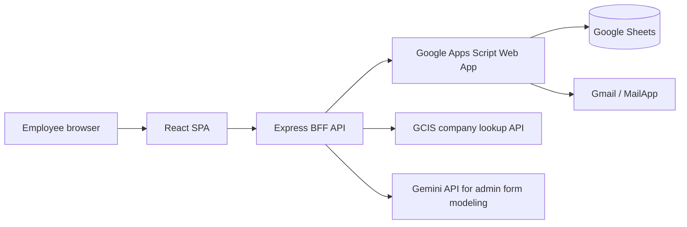
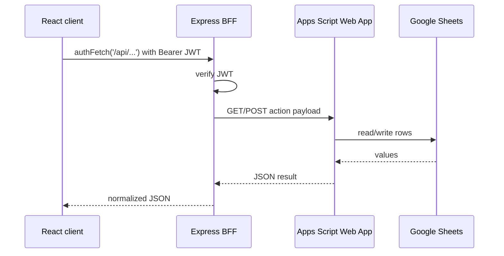
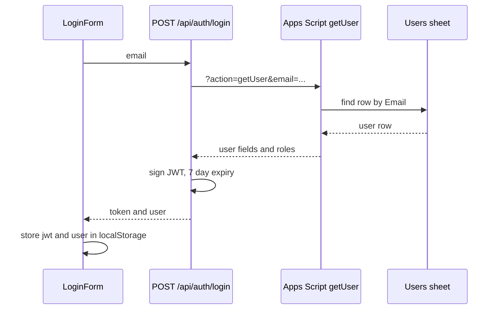
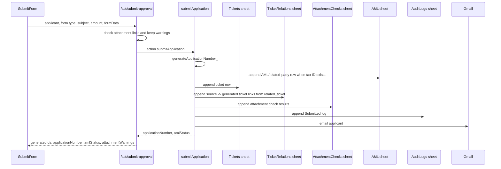
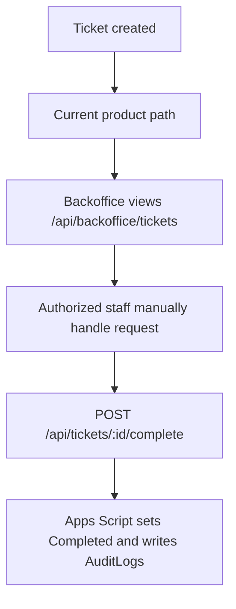
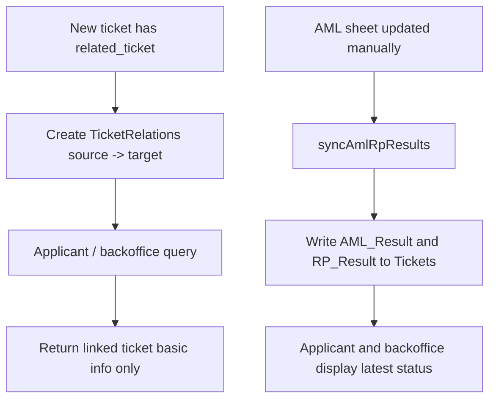
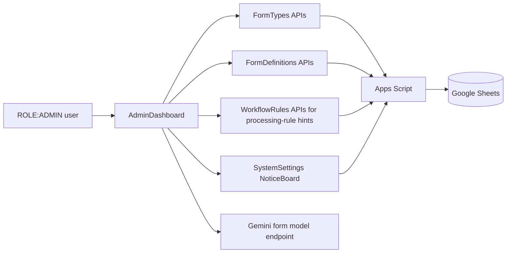
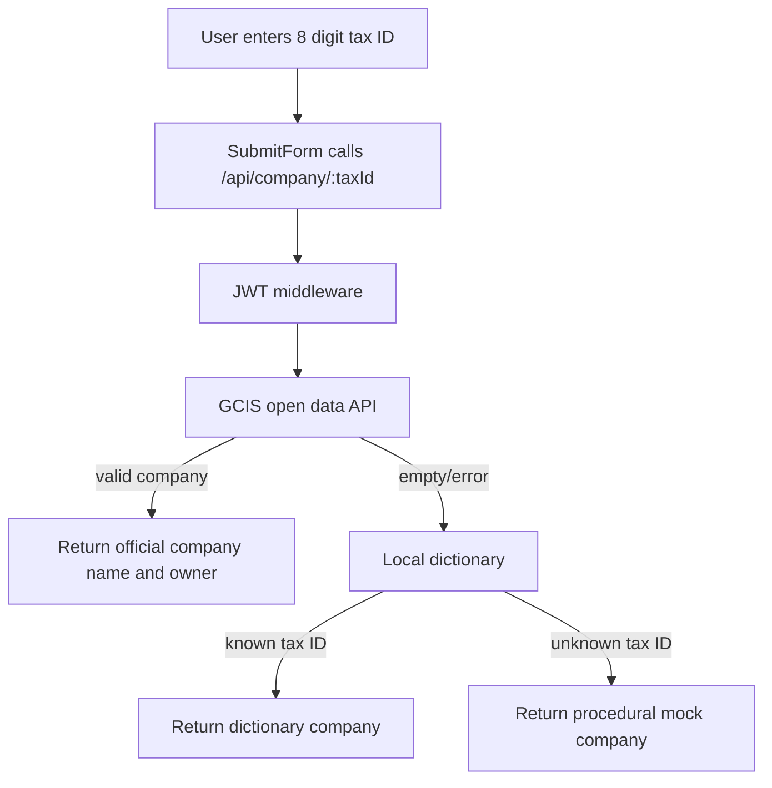

# Architecture

## High-level architecture

The application is a React single-page app backed by an Express BFF. Express handles JWT auth, route authorization, response shaping, local development fallback behavior, and calls to Google Apps Script. Apps Script is the persistent data adapter and operational integration layer for Google Sheets and email.

## Client to Express to Apps Script to Google Sheets flow

If `GOOGLE_APPS_SCRIPT_URL` is missing, many BFF endpoints return mock data. This is useful for development but must not be used as production truth.

Vercel executes JavaScript functions at runtime, so `api/app.js` is generated from `server/app.ts` by `npm run sync:api` before lint/build and is kept in the repository as the runtime companion.

## Authentication flow

Every protected request uses `authFetch`, which attaches the stored JWT. A 401 clears the JWT and emits `auth-expired`.

## Form submission flow

Production submission currently uses `submitApplication`, not the older `submitTickets` flow.

## Backoffice completion flow

The visible UI is currently backoffice completion oriented. Legacy per-stage approval APIs were removed from the Express BFF; `apps-script-latest.js` still contains some historical actions and should be reconciled after confirming the deployed Apps Script source.

## Ticket relation and investigation sync flow

`WorkflowRules` is now treated as a backoffice processing-rule table. If an old per-stage workflow header is found, Apps Script archives it to a `WorkflowRules_Legacy_*` sheet and resets `WorkflowRules` to the new processing-rule headers.

## Admin configuration flow

Admin writes are allowed only through UI gating and some BFF checks. Some write endpoints should still be reviewed for consistent server-side `ROLE:ADMIN` enforcement.

## Company lookup flow

The procedural mock fallback is useful for testing but is a production data-quality risk if users treat it as verified company data.
